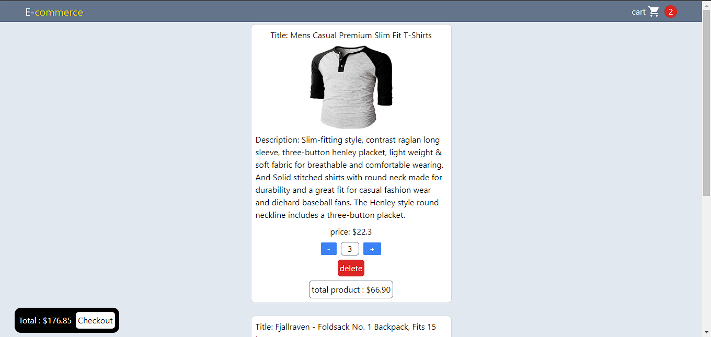

# E-Commerce Web App with React and Redux Toolkit

This is a simple e-commerce web application built with React, Redux Toolkit, Tailwind CSS, Material-UI, and React Router. Please note that the project prioritizes functionality over design, and it currently includes two main pages: the main shopping page and the cart page.

## Features

- Browse a list of products on the main page.
- Add and remove products from the cart.
- View your selected products in the cart.
- Navigate between the main page and the cart page using React Router.
- Utilizes Material-UI for buttons and card components.
- Styled using Tailwind CSS.

## Installation

1. Clone the repository to your local machine:
git clone https://github.com/omarker09/ecommerce-reduxToolkit.git

2. Change to the project directory:
cd ecommerce-reduxToolkit

3. Install the project dependencies:
npm install

4. To start the development server and run the project, use the following command:
npm start

This will launch the application in your default web browser. You can start browsing products and adding them to your cart.

